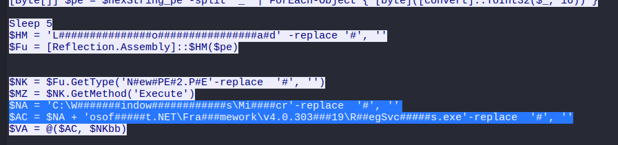

  
# Cyberdefenders - XLMRat

 
## GUÍA COMPLETA EN ESPAÑOL 

  
  
  

  

# Índice

## · Question 1  
## · Question 2  
## · Question 3
## · Question 4  
## · Question 5  
## · Question 6  
## · Question 7

## Question 1: The attacker successfully executed a command to download the first stage of the malware. What is the URL from which the first malware stage was installed? / El atacante ejecutó un comando para descargar la primera etapa de un malware de manera exitosa. ¿Cuál es la URL de dicha primera etapa de malware que fué instalada?  

Nada más abro el archivo pcap, encuentro log que me llama la atención:

Luego, miramos en HTTP dentro de TCP y encontraríamos la URL del primer stage del malware:  

## Question 2: Which hosting provider owns the associated IP address? / ¿Qué proveedor de hosting es el propietario de la dirección IP asociada?

Para responder a esta pregunta, lo único que vamos a hacer es usar la herramienta whois:  

**¿Qué es WHOIS**
Es una herramienta de footprinting que  se utiliza para consultar información pública sobre dominios e IPs en internet.

Con WHOIS puedes obtener:

· **Datos del registrante:** nombre, organización (si no está oculto por privacidad).

· **Información del registrador:** la empresa donde se registró el dominio.

· **Fechas clave:** creación, última actualización y expiración del dominio.

· **Datos de servidores de nombres (DNS).**

· **Proveedor / propietario del rango de IP.**

En resumen: WHOIS sirve para identificar quién administra un dominio o una dirección IP y con qué proveedor está asociado.

## Question 3: By analyzing the malicious scripts, two payloads were identified: a loader and a secondary executable. What is the SHA256 of the malware executable? / Al analizar los scripts maliciosos, se identificaron dos payloads: un cargador y un ejecutable secundario. ¿Cuál es el SHA256 del ejecutable malicioso?  

Para encontrar el hash debemos de irnos al log de mdm.jpg, hacer click derecho, pinchar en follow y http stream:

Dentro de esta ventana, copiamos el código hexadecimal $hexString_bbb y nos lo llevamos a ciberchef para sacar el hash md5:

Y ahora buscamos este hash en virustotal:

## Question 4: What is the malware family label based on Alibaba? / ¿Cuál es la clasificación de la familia de malware según Alibaba?

Dentro de la misma búsqueda de antes en virutotal observamos:

## Question 5: What is the timestamp of the malware's creation? / ¿Cuál es la fecha de creación del malware?

En virustotal, nos vamos a details y bajamos hasta la sección de history:  

## Question 6: Which LOLBin is leveraged for stealthy process execution in this script? Provide the full path. / ¿Qué LOLBin se aprovecha para la ejecución sigilosa de procesos en este script? Proporciona la ruta completa.

Volvemos al pcap en el log que hicimos folow>http stream:  

Tenemos que sumar las dos rutas señaladas quitando los '#', quedaría la ruta C:\Windows\Microsoft.NET\Framework\v4.0.30319\RegSvcs.exe.

**¿Qué es un LOLBin?** 

Son programas legítimos que ya vienen instalados en el sistema operativo y que los atacantes usan para hacer acciones maliciosas sin necesidad de añadir malware externo.

**¿Qué función realiza RedSvcs.exe?**
Su función principal es registrar ensamblados (.NET assemblies) para que Windows/COM+ pueda usarlos como componentes administrados. 

Registrar un ensamblado es crear las entradas necesarias en el sistema (registro, catálogo COM+, type libraries) para que las clases .NET se comporten como objetos COM y puedan ser instanciadas por otros programas o servicios del sistema.

En la práctica, pasas una DLL .NET a RegSvcs.exe y éste ejecuta código de instalación/registro que puede crear servicios, componentes COM+, etc.

## Question 7: The script is designed to drop several files. List the names of the files dropped by the script / El script está diseñado para generar varios archivos. Enumera los nombres de los archivos que crea el script.

Para encontrar los archivos generados, bajamos un poco de donde encontramos el LOLBin, debemos de ir bajando y buscar las rutas de este estilo; los archivos son Conted.ps1, Conted.bat, Conted.vbs:  

# DISCLAIMER

Este writeup es SOLO para propósitos educativos.  
Úsalo responsablemente en entornos autorizados como Cyberdefenders.  

**Autor:** pablocaraballofernandez  
**Plataforma:** Cyberdefenders

  
  
  
  
  .
  

